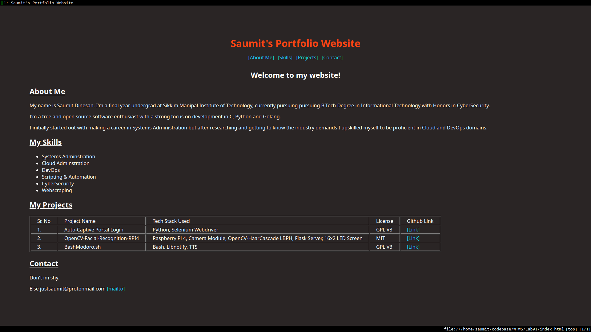

# Portfolio Webpage
This repository contains a simple HTML webpage that acts as a portfolio website.

## Table of Contents

- [Description](#description)
- [Brief Look](#brief-look)

## Description

The portfolio website provides a brief introduction about me, my skills, projects and how to contact me. It is built using basic HTML and CSS and makes use of HTML Tables to showcase my work in a clean and organized manner.

## Brief Look
Here is a screenshot of the current look of the website:

