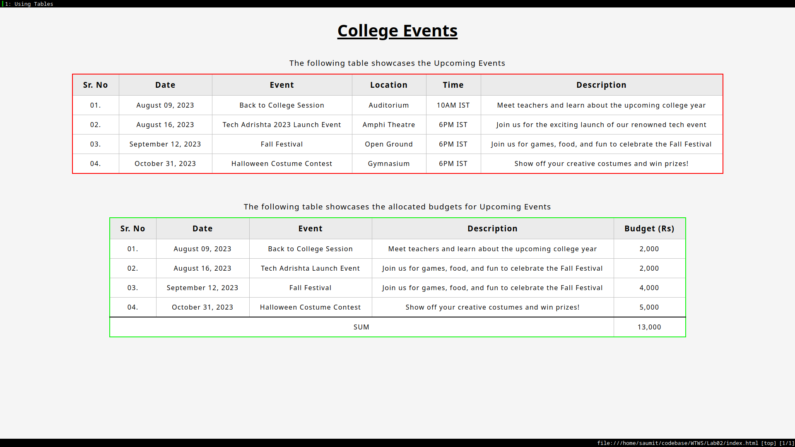

# College Events Webpage
This directory contains a simple HTML webpage that lists upcoming college events and their budgets. It uses HTML table for structuring the event information.

## Table of Contents

- [Description](#description)
- [Brief Look](#brief-look)
- [To-Do List](#to-do-list)

## Description

The webpage provides a clear overview of upcoming school events, their dates, locations, descriptions, and budgets. The use of HTML tables allows for organized presentation of event details.

## Brief Look
Here is a screenshot of the current look of the website:

## To-Do List

- [ ] **JavaScript for Sum:** Implement JavaScript to dynamically calculate and display the total budget of all events instead of having to manually update it in the HTML.

- [ ] **Event Sorting:** Add functionality to sort events by date or budget in ascending or descending order.

- [ ] **Event Details Page:** Create individual pages for each event with more detailed information and the option to RSVP.

- [ ] **Event Images:** Include images for each event to make the webpage visually appealing.

- [ ] **Responsive Design:** Make the webpage responsive to different screen sizes and devices.

- [ ] **Event Countdown:** Add a countdown timer for each event to build anticipation.

- [ ] **Interactive Maps:** Integrate interactive maps for event locations using APIs like Google Maps.
