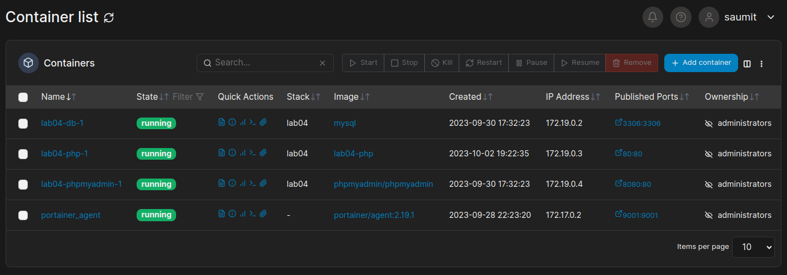
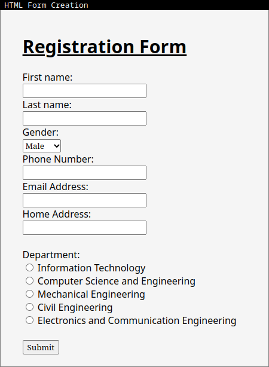
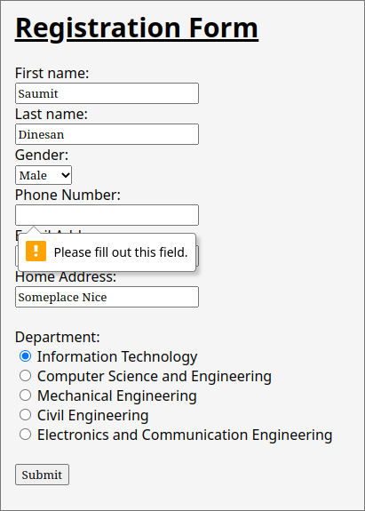
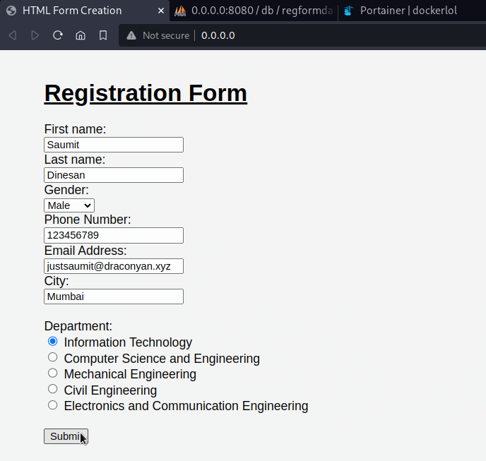
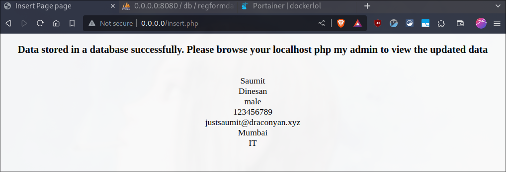
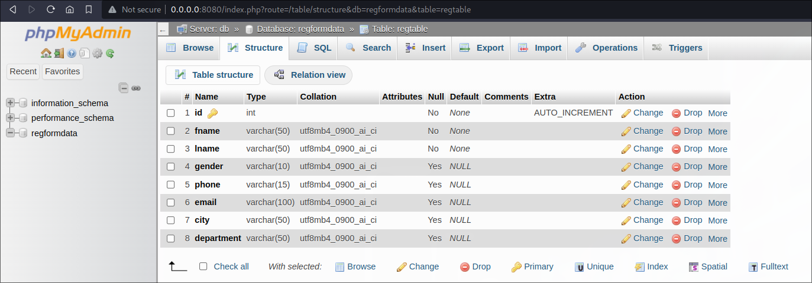
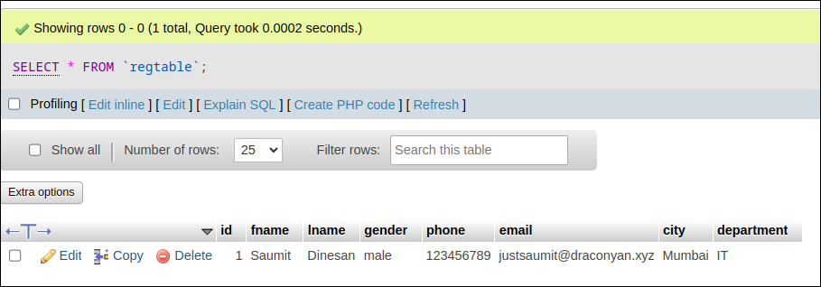

# Lab04: HTML Form Validation

This directory contains the necessary files for a simple registration form webpage.  
The registration form collects various details from the user, such as their first name, last name, gender, registration number, phone number, email address, and department.

## Table of Contents

- [Description](#description)
- [Screenshots](#screenshots)
- [Usage](#usage)

---

## Description

This repository contains code for a simple registration form with HTML form validation. The form collects user information such as first name, last name, gender, phone number, email address, city, and preferred department. It then inserts this information into a MySQL database using PHP.

## Screenshots


<u><p style="text-align:center;">Using Portainer to Manage containers</p></u>


<u><p>Sample HTML Form</p></u>


<u><p>HTML Form Validation warning for empty fields being present after submission</p></u>

## Usage

### Prerequisites

Before you can use this code, ensure you have the following software and dependencies installed as I would be leveragin docker containers for running Apache,PHP, MySQL database and phpMyAdmin:

- Docker: [Docker Installation Guide](https://docs.docker.com/get-docker/)
- Docker Compose: [Docker Compose Installation Guide](https://docs.docker.com/compose/install/)

### Steps to Run the Application

1. Clone the repository:

   ```bash
   git clone https://github.com/justsaumit/WTWS.git
   ```

2. Navigate to the project directory:

   ```bash
   cd WTWS/Lab04
   ```

3. Create an `.env` file in the project root directory and configure the database and environment variables as needed (based on your preferences):

   ```yaml
   MYSQL_ROOT_PASSWORD=samplerootpassword
   MYSQL_DATABASE=regformdata
   MYSQL_USER=sampleusername
   MYSQL_PASSWORD=sampleusername

   DB_SERVER=db
   DB_USERNAME=sampleusername
   DB_PASSWORD=samplepassword
   DB_NAME=regformdata
   DB_TABLE=regtable
   ```

4. Build and start the Docker containers using Docker Compose:

   ```bash
   docker-compose up -d
   ```

5. Once the containers are up and running, you can access the registration form in your web browser at `http://localhost`. You can also access phpMyAdmin at `http://localhost:8080` to manage the MySQL database.

6. To create the database table, open a web browser and navigate to `http://localhost/create_table.php`. This PHP script will create the necessary table in the database.

    
    <u><p style="text-align:center;">Step 6: Create database table using php</p></u>

7. Fill out the registration form and click "Submit" to insert the data into the database.

   
   <u><p style="text-align:center;">Step 7: Fill out the registration form properly and click on Submit button</p></u>

    
    <u><p style="text-align:center;">PHP output confirming successful data insertion in the database</p></u>

8. To view the inserted data, you can use phpMyAdmin or connect to the MySQL database directly using your preferred MySQL client.

    
    <u><p style="text-align:center;">Confirming table creation in phpMyAdmin</p></u>

    
    <u><p style="text-align:center;">Confirming data insertion in phpMyAdmin</p></u>

9. To stop and remove the Docker containers, run:

   ```bash
   docker-compose down
   ```
