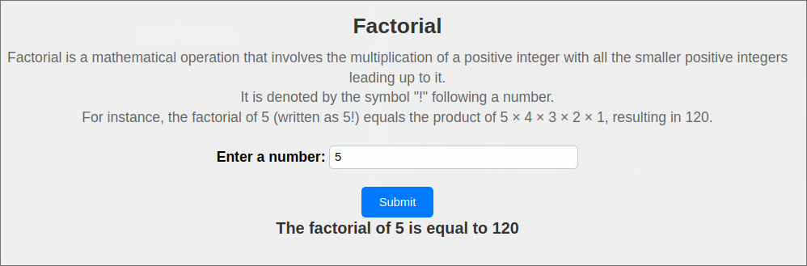

# Lab04 - Factorial Calculator

This directory contains files for a simple web application that calculates the factorial of a non-negative integer entered by the user using Javascript and displays using `innerText`.

## Description

Factorial is a mathematical operation that involves the multiplication of a positive integer with all the smaller positive integers leading up to it. This web application allows users to input a number, and it will calculate and display the factorial of that number.

## Brief Look

